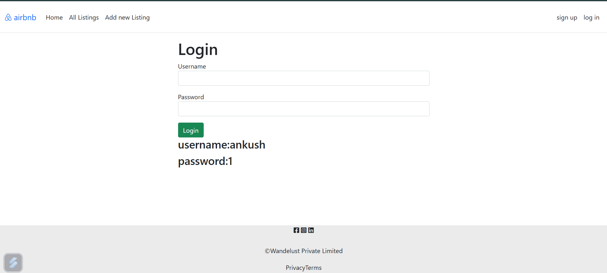
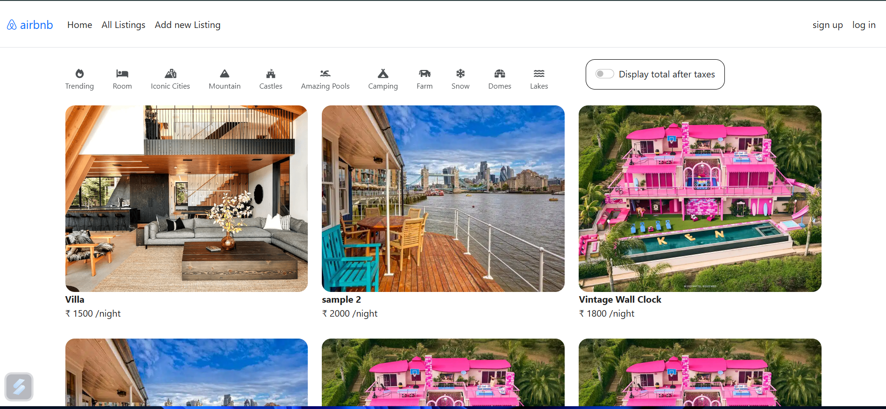
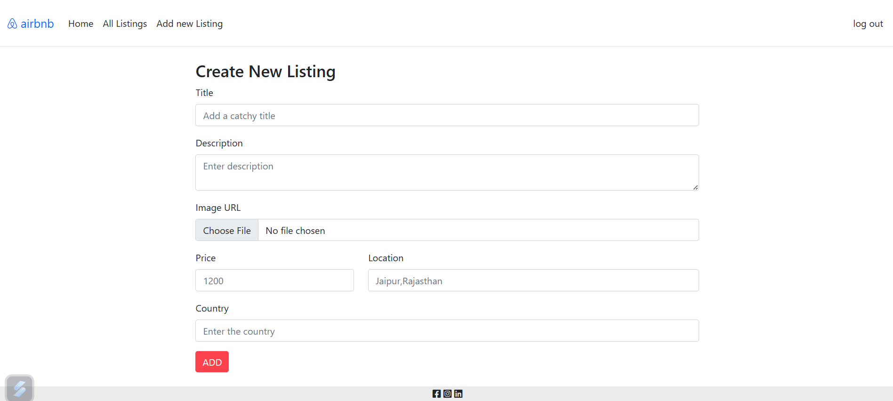

#🏠 Airbnb Clone – Rental Listing Web App

This is a full-stack web application that replicates the core functionality of Airbnb. Users can view property listings, add new listings, and log in to manage them. The interface is clean, responsive, and user-friendly, making it ideal for showcasing rental properties.

> 🚨 **Note:** Since the backend and frontend is hosted on Render, it may take a few moments to respond.

---

## 🔗 Live Website

🌐 [https://majorproject-09yx.onrender.com](https://majorproject-09yx.onrender.com)

---

## 🔐 Credentials

### 👨‍🏫 Admin Login
- **Email:** `admin@gmail.com`
- **Password:** `123456789`

### 👨‍🎓 Login Credentials
- Username: ankush  
- Password: 1

---

🌟 Features
🏡 View all available rental listings with images, titles, and prices.

➕ Add a new listing with image upload, title, description, price, location, and country.

🔐 Simple login system (username/password-based).

🧾 Toggle to display total price after taxes.

✨ Clean and modern UI inspired by Airbnb.

---

## 🖼️ Screenshots

### 🔑 Login Page

 <!-- Replace with your actual image path -->

### 🛠 Home Dashboard

 <!-- Replace with your actual image path -->

### 🛠 Add Listing

 <!-- Replace with your actual image path -->

---

## 🚀 Tech Stack

- **Frontend:** HTML, CSS, JavaScript,Ejs
- **Backend:** Node.js + Express
- **Database:** MongoDB (MongoDB Atlas)
- **Hosting:** 
  - Frontend and Backend: Render

